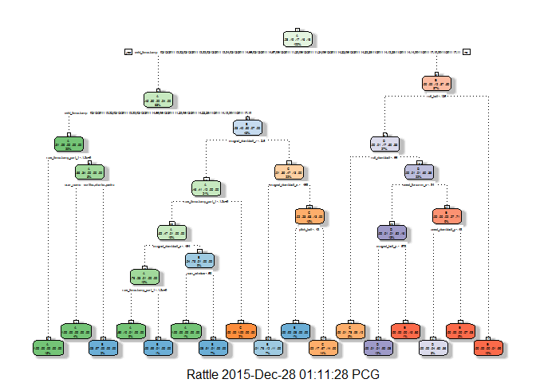
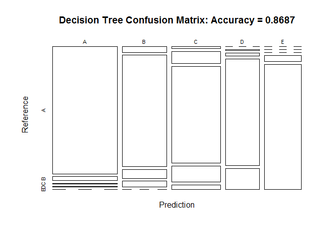
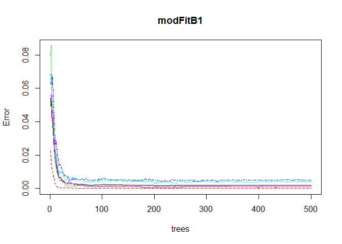
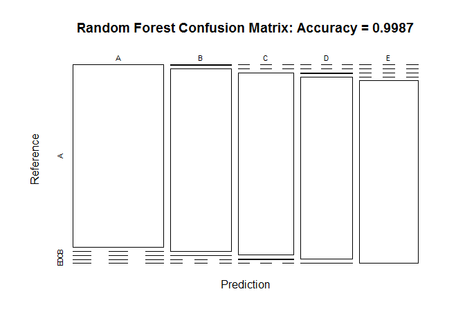

Introduction
============

Background
----------

Using devices such as Jawbone Up, Nike FuelBand, and Fitbit it is now
possible to collect a large amount of data about personal activity
relatively inexpensively. These type of devices are part of the
quantified self movement - a group of enthusiasts who take measurements
about themselves regularly to improve their health, to find patterns in
their behavior, or because they are tech geeks. One thing that people
regularly do is quantify how much of a particular activity they do, but
they rarely quantify how well they do it. In this project, your goal
will be to use data from accelerometers on the belt, forearm, arm, and
dumbell of 6 participants. They were asked to perform barbell lifts
correctly and incorrectly in 5 different ways. More information is
available from the website here:
<http://groupware.les.inf.puc-rio.br/har> (see the section on the Weight
Lifting Exercise Dataset).

Data
----

The training data for this project are available here:

<https://d396qusza40orc.cloudfront.net/predmachlearn/pml-training.csv>

The test data are available here:

<https://d396qusza40orc.cloudfront.net/predmachlearn/pml-testing.csv>

The data for this project come from this source:
<http://groupware.les.inf.puc-rio.br/har>. If you use the document you
create for this class for any purpose please cite them as they have been
very generous in allowing their data to be used for this kind of
assignment.

To Do
-----

The goal of your project is to predict the manner in which they did the
exercise. This is the "classe" variable in the training set. You may use
any of the other variables to predict with. You should create a report
describing how you built your model, how you used cross validation, what
you think the expected out of sample error is, and why you made the
choices you did. You will also use your prediction model to predict 20
different test cases.

Loading the data
================

    # set.seed for reproducibility
    set.seed(123)

    trainingUrl <- "http://d396qusza40orc.cloudfront.net/predmachlearn/pml-training.csv"
    testingUrl <- "http://d396qusza40orc.cloudfront.net/predmachlearn/pml-testing.csv"

    training <- read.csv(url(trainingUrl), na.strings = c("NA", "#DIV/0!", ""))
    testing <- read.csv(url(testingUrl), na.strings = c("NA", "#DIV/0!", ""))

Partioning the data.

    inTrain <- createDataPartition(training$classe, p=0.6, list=FALSE)
    myTraining <- training[inTrain, ]
    myTesting <- training[-inTrain, ]
    dim(myTraining); dim(myTesting)

    ## [1] 11776   160

    ## [1] 7846  160

Cleaning Data
=============

Remove NearZeroVariance variables:

    nzv <- nearZeroVar(myTraining, saveMetrics = TRUE)
    myTraining <- myTraining[, nzv$nzv == FALSE]

    nzv <- nearZeroVar(myTesting, saveMetrics = TRUE)
    myTesting <- myTesting[, nzv$nzv == FALSE]

Remove the first column of the myTraining data set:

    myTraining <- myTraining[c(-1)]

Clean variables with more than 60% NA:

    trainingV3 <- myTraining
    for(i in 1:length(myTraining)) {
        if(sum(is.na(myTraining[, i])) / nrow(myTraining) >= .7) {
            for(j in 1:length(trainingV3)) {
                if( length(grep(names(myTraining[i]), names(trainingV3)[j])) == 1)  {
                    trainingV3 <- trainingV3[ , -j]
                }   
            } 
        }
    }

    # Set back to the original variable name
    myTraining <- trainingV3
    rm(trainingV3)

Transform the myTesting and testing data sets:

    clean1 <- colnames(myTraining)
    clean2 <- colnames(myTraining[, -58])  # remove the classe column
    myTesting <- myTesting[clean1]         # allow only variables in myTesting that are also in myTraining
    testing <- testing[clean2]             # allow only variables in testing that are also in myTraining

    dim(myTesting)

    ## [1] 7846   58

    dim(testing)

    ## [1] 20 57

Coerce the data into the same type:

    for (i in 1:length(testing) ) {
        for(j in 1:length(myTraining)) {
            if( length( grep(names(myTraining[i]), names(testing)[j]) ) == 1)  {
                class(testing[j]) <- class(myTraining[i])
            }      
        }      
    }

    # To get the same class between testing and myTraining
    testing <- rbind(myTraining[2, -58] , testing)
    testing <- testing[-1,]

Prediction with Decision Trees
==============================

    set.seed(123)
    modFitA1 <- rpart(classe ~ ., data=myTraining, method="class")
    fancyRpartPlot(modFitA1)

    predictionsA1 <- predict(modFitA1, myTesting, type = "class")
    cmtree <- confusionMatrix(predictionsA1, myTesting$classe)
    cmtree

    ## Confusion Matrix and Statistics
    ## 
    ##           Reference
    ## Prediction    A    B    C    D    E
    ##          A 2144   63    9    2    0
    ##          B   65 1291  102   65    0
    ##          C   23  157 1233  204   61
    ##          D    0    7   24  956  189
    ##          E    0    0    0   59 1192
    ## 
    ## Overall Statistics
    ##                                          
    ##                Accuracy : 0.8687         
    ##                  95% CI : (0.861, 0.8761)
    ##     No Information Rate : 0.2845         
    ##     P-Value [Acc > NIR] : < 2.2e-16      
    ##                                          
    ##                   Kappa : 0.834          
    ##  Mcnemar's Test P-Value : NA             
    ## 
    ## Statistics by Class:
    ## 
    ##                      Class: A Class: B Class: C Class: D Class: E
    ## Sensitivity            0.9606   0.8505   0.9013   0.7434   0.8266
    ## Specificity            0.9868   0.9633   0.9313   0.9665   0.9908
    ## Pos Pred Value         0.9666   0.8477   0.7348   0.8129   0.9528
    ## Neg Pred Value         0.9844   0.9641   0.9781   0.9505   0.9621
    ## Prevalence             0.2845   0.1935   0.1744   0.1639   0.1838
    ## Detection Rate         0.2733   0.1645   0.1572   0.1218   0.1519
    ## Detection Prevalence   0.2827   0.1941   0.2139   0.1499   0.1594
    ## Balanced Accuracy      0.9737   0.9069   0.9163   0.8549   0.9087

    plot(cmtree$table, col = cmtree$byClass, main = paste("Decision Tree Confusion Matrix: Accuracy =", round(cmtree$overall['Accuracy'], 4)))

Prediction with Random Forests
==============================

    set.seed(123)
    modFitB1 <- randomForest(classe ~ ., data=myTraining)
    predictionB1 <- predict(modFitB1, myTesting, type = "class")
    (cmrf <- confusionMatrix(predictionB1, myTesting$classe))

    ## Confusion Matrix and Statistics
    ## 
    ##           Reference
    ## Prediction    A    B    C    D    E
    ##          A 2231    0    0    0    0
    ##          B    1 1518    2    0    0
    ##          C    0    0 1362    2    0
    ##          D    0    0    4 1284    1
    ##          E    0    0    0    0 1441
    ## 
    ## Overall Statistics
    ##                                           
    ##                Accuracy : 0.9987          
    ##                  95% CI : (0.9977, 0.9994)
    ##     No Information Rate : 0.2845          
    ##     P-Value [Acc > NIR] : < 2.2e-16       
    ##                                           
    ##                   Kappa : 0.9984          
    ##  Mcnemar's Test P-Value : NA              
    ## 
    ## Statistics by Class:
    ## 
    ##                      Class: A Class: B Class: C Class: D Class: E
    ## Sensitivity            0.9996   1.0000   0.9956   0.9984   0.9993
    ## Specificity            1.0000   0.9995   0.9997   0.9992   1.0000
    ## Pos Pred Value         1.0000   0.9980   0.9985   0.9961   1.0000
    ## Neg Pred Value         0.9998   1.0000   0.9991   0.9997   0.9998
    ## Prevalence             0.2845   0.1935   0.1744   0.1639   0.1838
    ## Detection Rate         0.2843   0.1935   0.1736   0.1637   0.1837
    ## Detection Prevalence   0.2843   0.1939   0.1738   0.1643   0.1837
    ## Balanced Accuracy      0.9998   0.9998   0.9977   0.9988   0.9997

    plot(modFitB1)

    plot(cmrf$table, col = cmtree$byClass, 
            main = paste("Random Forest Confusion Matrix: Accuracy =", 
            round(cmrf$overall['Accuracy'], 4)))

Prediction with Generalized Boosted Regression
==============================================

    set.seed(123)
    fitControl <- trainControl(method = "repeatedcv",
                               number = 5,
                               repeats = 1)

    gbmFit1 <- train(classe ~ ., data=myTraining, method = "gbm",
                     trControl = fitControl,
                     verbose = FALSE)

    ## Loading required package: plyr

    gbmFinMod1 <- gbmFit1$finalModel

    gbmPredTest <- predict(gbmFit1, newdata=myTesting)
    (gbmAccuracyTest <- confusionMatrix(gbmPredTest, myTesting$classe))

    ## Confusion Matrix and Statistics
    ## 
    ##           Reference
    ## Prediction    A    B    C    D    E
    ##          A 2232    2    0    0    0
    ##          B    0 1514    3    0    0
    ##          C    0    1 1355    5    0
    ##          D    0    1   10 1281    4
    ##          E    0    0    0    0 1438
    ## 
    ## Overall Statistics
    ##                                           
    ##                Accuracy : 0.9967          
    ##                  95% CI : (0.9951, 0.9978)
    ##     No Information Rate : 0.2845          
    ##     P-Value [Acc > NIR] : < 2.2e-16       
    ##                                           
    ##                   Kappa : 0.9958          
    ##  Mcnemar's Test P-Value : NA              
    ## 
    ## Statistics by Class:
    ## 
    ##                      Class: A Class: B Class: C Class: D Class: E
    ## Sensitivity            1.0000   0.9974   0.9905   0.9961   0.9972
    ## Specificity            0.9996   0.9995   0.9991   0.9977   1.0000
    ## Pos Pred Value         0.9991   0.9980   0.9956   0.9884   1.0000
    ## Neg Pred Value         1.0000   0.9994   0.9980   0.9992   0.9994
    ## Prevalence             0.2845   0.1935   0.1744   0.1639   0.1838
    ## Detection Rate         0.2845   0.1930   0.1727   0.1633   0.1833
    ## Detection Prevalence   0.2847   0.1933   0.1735   0.1652   0.1833
    ## Balanced Accuracy      0.9998   0.9984   0.9948   0.9969   0.9986

    plot(gbmFit1, ylim=c(0.9, 1))

Predicting Results on the Test Data
===================================

Random Forests gave an Accuracy in the myTesting dataset of 99.89%,
which was more accurate that what I got from the Decision Trees or GBM.
The expected out-of-sample error is 100-99.89 = 0.11%.

    (predictionB2 <- predict(modFitB1, testing, type = "class"))

    ##  2  3 41  5  6  7  8  9 10 11 12 13 14 15 16 17 18 19 20 21 
    ##  B  A  B  A  A  E  D  B  A  A  B  C  B  A  E  E  A  B  B  B 
    ## Levels: A B C D E

    # Write the results to a text file for submission
    pml_write_files = function(x){
        n = length(x)
        for(i in 1:n){
            filename = paste0("problem_id_",i,".txt")
            write.table(x[i],file=filename,quote=FALSE,row.names=FALSE,col.names=FALSE)
        }
    }

    pml_write_files(predictionB2)
